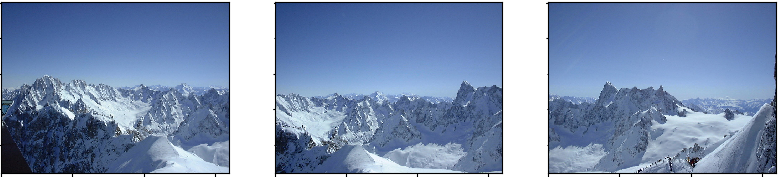
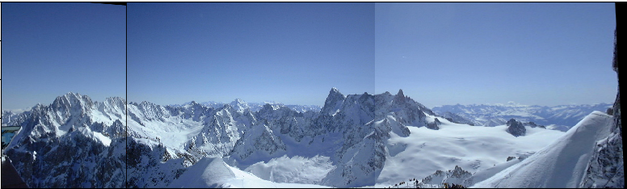

# panoramaStitcher

Automatic panorama stitching program using OpenCV library for python

## Usage
`python panorama.py [-h] imgfile [imgfile ...]`

## Sample images
(Photographs taken from http://www.photofit4panorama.com/gallery.html)
### Input

### Output

## Improvements to be made
- Blending to remove seams
- Cylindrical projection
- Automatic image ordering
- Optimization
